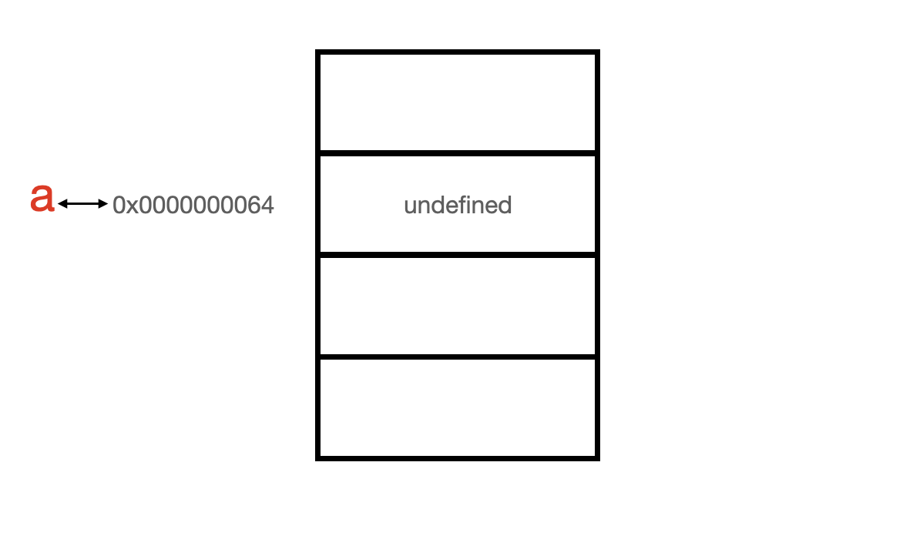
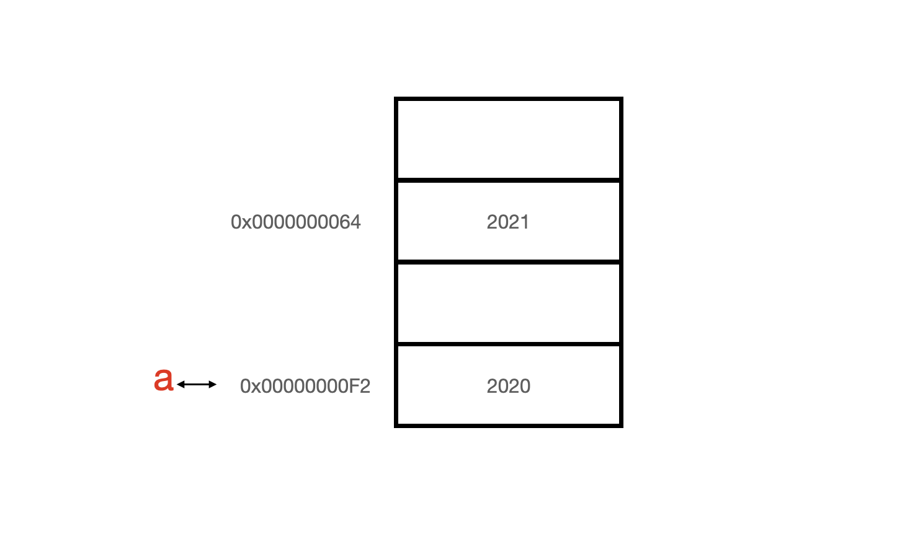
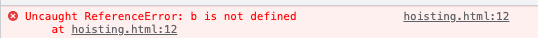
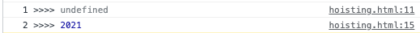

# 2. 변수

# 1. 변수란

## 1) 컴퓨터가 값을 기억하는 방법

컴퓨터는 메모리를 사용하여 데이터를 저장한다. 메모리는 데이터를 저장 할 수 있는 메모리 셀의 집합으로, 메모리셀 하나의 크키는 1바이트이다. 각 메모리셀은 고유의 주소를 갖는데, 주소는 메모리셀의 위치를 나타낸다.

아래와 같은 코드를 JS를 통해 실행하면 컴퓨터는 어떻게 동작 할 지 생각해보자.

```jsx
var a = 2021;
```


데이터는 하나의 메모리셀에 저장되며, 데이터가 숫자던, 문자던 종류에 상관없이 2진수로 저장된다. 따라서, 2021이라는 숫자는 2진수로 변환되었고, 컴퓨터에 의해 임의로 0x00000064 주소를 갖는 공간에 저장되었다. 

> ∴ 컴퓨터는 메모리셀에 값을 저장하고, 각 메모리셀은 식별 가능한 주소값을 갖는다.

## 2) 변수 정의


이제 2021이라는 값을 사용 할 수 있게 되었다. 그런데 어떻게 사용해야한단 말인가? 우선 생각나는 것은 0x00000064라는 유니크한 주소가 있으므로 이 주솟값으로 2021 값을 특정하여 사용하는 방법이 생각난다. 

```jsx
console.log("올해는" + 0x00000064 + "년 입니다")
//E(X): 올해는 2021년 입니다.
```

위와 같은 코드가 기댓값과 같은 결과를 출력 할 수 있을까? 해보면 알겠지만(굳이?) 우리가 원하는 결과값이 나오지 않는다. 그 이유 중  첫번째는 "0x00000064"라는 주솟값은 매번 변경되기 때문이다.  JS 코드가 실행 될 때 컴퓨터의 상황에 맞춰 주솟값은 유동적으로 결정된다. 따라서 2021이라는 값이 저장된 공간의 주소가 언제나 0x00000064인것을 보장 할 수 없다. 

두 번째는 2021 값이 저장된 공간의 주소가 0x00000064로 보장된다 치더라도 JS는 개발자가 메모리에 직접 접근하는것을 허용하지 않는다. JS는 클라이언트에서 사용되는 언어이다. JS를 통해 사용자의 메모리에 직접 접근 할 수 있다면 어떤 결과가 초래될지는 각자의 상상에 맡기겠다.(JS에서 어떤 행동에 제약이 있거나 불가능한 경우 JS가 클라이언트에서 사용되는 언어라는 점을 한 번 생각하면 이해될 때가 종종 있다!)

그렇기 때문에 우리는 `변수`라는 것을 사용해야한다. 

```jsx
var a = 2021;
```


이전의 코드를 다시 가져와봤다.

우리가 놓친 부분은 `var a =` 부분이다. var 키워드를 제쳐놓고 보면 직관적으로 우리는 '아! a는 2021을 의미하는 구나!' 라고 느낄  수 있다. 사실 이정도만 이해해도 JS를 사용하는데 큰 무리가 없으나 좀 더 자세히 살펴보자!

결론부터 말하면 a는 2021이라는 값이 저장된 공간의 주솟값인 0x00000064이다. 이해를 돕기위해 약간의 상황극을 준비했다.

1. 나는 컴퓨터다. 주인놈이 20이라는 숫자를 저장하라고 시켰다. 적당한 공간을 찾아줘야겠다.
2. 주솟값이 0x00000064 공간이 마침 비어있다. 여기에 2021을 저장하면 되겠다. 이진수로 바꿔서
3. 주인놈이 'a' 라고 하면 난 이제부터 2021을 갖다바쳐야한다. 까먹을 수 도 있으니까 포스트잇에 a = 0x00000064라고 적어놨다.
4. 주인놈이 a를 호출했다. 포스트잇을 보니  a는 0x00000064라고 적어놨다. 그래서 0x00000064를 찾아갔다.
5. 0x00000064를 찾아가 보니 11111100101 이라는 값이 저장되어있다. 이대로 가져다 주면 주인놈이 싫어할테니 10진수로 바꿔서 2021을 가져다줬다. 난 친절한 컴퓨터니까...

앞서 말했듯 2021이 저장된 공간의 주솟값은 JS가 실행 될 때마다 유동적으로 바뀐다. 어떤 주소로 변경될지 실행하기 전엔 알 수 없다. 

다만, 2021이 저장된 공간의 주솟값이 뭐던지간에 그 주솟값을 기억해야하는 식별자가 a라는것에는 변함이 없다.

 

> ∴ 변수는 값이 저장된 공간의 주솟값을 기억한다. 즉, 변수는 값이 저장된 공간의 주솟값이다.

# 2. 변수의 선언과 할당

## 1) 변수의 선언

변수를 선언하기 위해서는 JS에서 미리 약속된 키워드를 사용해야 한다. 사용할 수 있는 키워드는 아래와 같다.

1. var
2. let
3. const

let과 const는 ES6에서 추가된 것으로 기존 var의 단점을 보완하기 위해 생겨났다. let과 const에 대해서는 추후 자세하게 다루도록 하겠다.

```jsx
var a;
```

위 변수 선언문은 아래와 같이 값을 저장할 공간을 확보하고 변수 이름을 등록한다. 



아직 변수에 값을 할당하지 않았으므로, 확보한 공간이 비어 있을것이라 생각 할 수 있지만 자바스크립트에 의해 undefined가 할당된다. 이를 `초기화 단계` 라고 한다. 초기화 단계를 거치는 이유는 확보한 메모리 공간에 이전에 실행되던 어플리케이션의 값이 남아있을 수 있는데 이를 제거하기 위함이다. 

정리하자면,  var 키워드를 사용한 변수 선언은  메모리 공간을 확보하고 변수 이름을 등록하는 변수의 선언 단계와 undefined를 할당하는 초기화 단계가 동시에 진행된다.

## 2) 값의 할당

변수에 값을 할당하는 경우 할당 연산자 `=` 를 사용한다. 

```jsx
var a = 2021
```

위 코드는 아래와 같이 2개의 단계를 거쳐서 실행된다.

```jsx
var a ;
a = 2021
```

값을 재 할당 하는 경우는 아래와 같이 할 수 있다.

```jsx
var a = 2021
a = 2002
```

이 경우 2021이 저장되어 있던 공간에 2002라는 값이 저장되는 것이 아니다. 2002 값은 별도의 공간에 저장되게 되고, 해당 공간의 주솟값으로 a가 가리키는 값이 변경되게 된다. (아래 그림은 10진수를 2진수로 변경하는 과정은 생략하였다.)



# 3. 호이스팅

```jsx
console.log("1 >>>>", a) //(1)

var a = 2021

console.log("2 >>>>", a) //(2)
```

위 예제를 실행한 후의 결과를 예상해보자. 

```jsx
var a = 2021
console.log(b)
```

위 코드와 같이 선언하지 않은 변수를 호출하는 경우 `ReferenceError` 가 발생하게 된다.



자바스크립트의 경우 특별한 경우가 아니라면 위에서 아래로 코드가 작성된 순서로 실행된다. 그렇다면 위 코드의 (1) 과정에서 a는 아직 선언되지 않았으므로 `ReferenceError` 가 발생될 것이라 예상된다.

코드 실행 결과는 아래와 같다.



예상했던 결과와 달리 (1)과정에서 에러가 아닌 undefined가 출력되었다. 이런 자바스크립트의 특징을 호이스팅(hoisting)이라고 한다. 

hoisting의 뜻을 사전에서 찾아보면 아래과 같이 나온다

끌어 올리기; 들어올려 나르기.

(1) 과정에서 아직 선언되지 않은 변수 a를 선언된 것처럼 끌어올리기 때문에 이 같은 이름이 붙은것 같다. 실제로 a가 끌어올려지는것은 아니고, 변수의 선언과 코드의 실행 단계가 달라서 생기는 현상이다.

변수의 선언은 코드가 실행되는 런타임 시점이 아닌, 그 이전 단계에서 먼저 실행된다. 이 단계를 소스코드의 `평가 과정` 이라고 하는데, 이 과정에서 변수 선언을 포함한 모든 선언문을 찾아내 먼저 실행하게 된다. 즉, 자바스크립트 코드 중 변수 선언은 어디에 있든 상관없이 다른 코드들 보다 먼저 실행된다. 따라서 변수 선언이 소스코드의 어디에 위치하든 상관없이 변수를 참조 할 수 있다.
