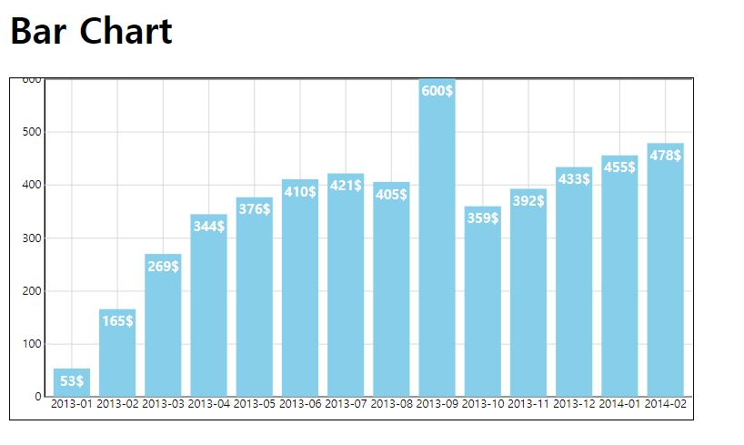

# Bar Chart Function

## install

```bash
# http-server install
npm install lite-server -g
```

```bash
# lite-server에서 테스트
lite-server
```

## 구성

사용자가 module을 import하여 사용 할 수 있도록 함수를 개발하였습니다.

`index.html`

```html
<!DOCTYPE html>
<html lang="en">
    <head>
        <meta charset="UTF-8" />
        <meta name="viewport" content="width=device-width, initial-scale=1.0" />
        <title>Bar-Chart</title>
        <script src="https://d3js.org/d3.v5.min.js"></script>
        <link rel="stylesheet" href="./src/styles.css" />
    </head>
    <body>
        <h1>Bar Chart</h1>
        <svg></svg>
        <script type="module" src="src/index.js"></script>
    </body>
</html>
```

`index.js`

```javascript
import { barChart } from "./barChart.js";

const init = () => {
    barChart("data.csv");
};

init();
```

`data.csv`

```
date,value
2013-01,53
2013-02,165
2013-03,269
2013-04,344
2013-05,376
2013-06,410
2013-07,421
2013-08,405
2013-09,600
2013-10,359
2013-11,392
2013-12,433
2014-01,455
2014-02,478
```

사용자가 csv파일을 전달하면 웹에 차트가 그려집니다.

`barChart.js`

```javascript
export const barChart = data => {
    //1. csv로부터 데이터 불러오기
    d3.csv(data)
        .then(dataSet => {
            dataSet.forEach(d => {
                // 2. 불러온 데이터의 type 변환
                d.x = d.date;
                d.y = +d.value;
            });
            const svg = d3.select("svg");

            //3. range의 화면 범위를 정하기위해 SVG의 CSS width, height값을 구해서 지정
            let width = parseInt(svg.style("width"), 10) - 30;
            let height = parseInt(svg.style("height"), 10) - 20;

            //4. 차트전체를 구성하는 그룹생성, 그룹자체는 30px이동, 차트생성시 y축과 첫번째 그래프가 겹치는것을 방지하기 위함
            let svgG = svg.append("g").attr("transform", "translate(30, 0)");

            //5. x축의 range 지정, 고정된 문자열이므로 scaleBand()
            let xScale = d3
                .scaleBand()
                .domain(dataSet.map(d => d.x))
                .range([0, width])
                .padding(0.2);

            //6. 척도를 이용하여 x축(axis) 작성
            svgG.append("g")
                .attr("class", "grid")
                .attr("transform", "translate(0," + height + ")")
                .call(d3.axisBottom(xScale).tickSize(-height));

            //7. y축의 range 지정, 일반 숫자값이므로 scaleLinear()
            let yScale = d3
                .scaleLinear()
                .domain([0, d3.max(dataSet, d => d.y)])
                .range([height, 0]);

            //8. 척도를 용하여 y축(axis) 작성
            svgG.append("g")
                .attr("class", "grid")
                .call(
                    d3
                        .axisLeft(yScale)
                        .ticks(5)
                        .tickSize(-width)
                );

            const barG = svgG.append("g");

            //9. 데이터를 이용하여 Bar Chart 생성
            barG.selectAll("rect")
                .data(dataSet)
                .enter()
                .append("rect")
                .attr("class", "bar")
                .attr("height", (d, i) => height - yScale(d.y))
                .attr("width", xScale.bandwidth())
                .attr("x", (d, i) => xScale(d.x))
                .attr("y", (d, i) => yScale(d.y));

            //10. 데이터를 이용하여 Chart text 생성
            barG.selectAll("text")
                .data(dataSet)
                .enter()
                .append("text")
                .text(d => d.y + "$")
                .attr("class", "text")
                .attr("x", function(d, i) {
                    return xScale(d.x) + xScale.bandwidth() / 2;
                })
                .style("text-anchor", "middle")
                .attr("y", function(d, i) {
                    return yScale(d.y) + 15;
                });
        })
        .catch(error => {
            console.log("then error : ", error);
        });
};
```

결과화면입니다.  

