# prismagram_react-graphql

Instragram clone with Express Prisma React and React Native

## Backend

1. [Setting](#Setting)
1. [Create Server](#Create-Server)
1. [Prisma](#Prisma)
1. [GraphQL API](#GraphQL-API)

### Setting

```bash
# Backend Sever
yarn add graphql-yoga

# devDependency for ES6
yarn add @babel/node @babel/preset-env @babel/core

#devDependency that do not requrie server restart when you modity your code
yarn add nodemon -D

#Dependency that protect your secret info
yarn add dotenv

# middleware for logging
yarn add morgan
```

```bash
#.babelrc in root
{
    "presets": ["@babel/preset-env"]
}
```

```bash
#Create script code in package.json in root
 "script": {
      "dev": "nodemon --exec babel-node src/server.js"
  }
```

```bash
# nodemon.json in root (nodemon이 감시해야 할 파일의 확장자를 지정 할 수 있음)
{
    "ext": "js qraphql"
}
```

```bash
# .env in root
PORT = 4000
```

### Create Server

GraphQL 서버를 구성 할 때 `schema`와 `resolver`를 구성하고 이를 서버 생성자 함수의 인자로 추가해 주어야한다. 아래 코드처럼 server에 관한 코드를 작성한 파일에 `schema`와 `resolver`를 작성 할 수도 있고 `schema`와 `resolver`를 별도의 파일로 구성하여서 서버를 구성 할 수도 있다. 별도의 파일로 서버를 구성하는 경우 `schema`파일에 서버에서 사용 할 모든 `schema`를 작성하게되고, `resolver`도 마찬가지로 모든 `resolver`를 하나의 파일에 작성해야 한다. 이는 코드의 가독성을 떨어트리고 유지보수의 어려움을 야기시키므로 필요한 데이터에 따라 `schema`와 `resolver`를 구성하는 방법에 대해 알아본다. [GraphQL의 기본적인 사용방법][1]에대해 잘 모른다면 정리한 README가 있으니 참고하도록 한다.

[1]: https://github.com/CHEOLHUN/basic-theory-graphql_graphql

```javascript
//server.js
//기본적인 GraphQL 서버 구성 코드
import { GraphQLServer } from "graphql-yoga";
import logger from "morgan";

require("dotenv").config();
const PORT = process.env.PORT || 4000;

console.log(PORT);

const typeDefs = `
  type Query{
    hello: String!
  }
`;

const resolvers = {
  Query: {
    hello: () => "Hi",
  },
};

const server = new GraphQLServer({ typeDefs, resolvers });
server.express.use(logger("dev"));
server.start({ port: PORT }, () =>
  console.log(`Server running on port http://localhost:${PORT}`)
);
```

`graphql-tools`과 `merge-graphql-schemas`를 사용하는 경우 여러개의 `schema`와 `resolver`를 하나의 파일로 합쳐서 관리 할 수 있다.

```bash
#install modules
yarn add graphql-tools
yarn add merge-graphql-schemas
```

디렉토리의 구성은 아래와 같이 구성하면 된다.
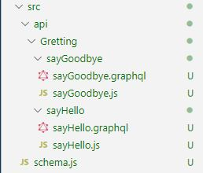

`api`디렉토리안에 모든 `schema`와 `resolver`에 대한 파일을 넣게되면 api 디렉토리에 있는 `schema.js`파일에서 이 모든 파일을 합쳐서 하나의 `scheme`와 `resolver`로 만들어 준다. `schema.js` 코드는 아래와 같다.

```javascript
//schma.js
import { makeExecutableSchema } from "graphql-tools";
import { fileLoader, mergeResolvers, mergeTypes } from "merge-graphql-schemas";
import path from "path";

const allTypes = fileLoader(path.join(__dirname, "/api/**/*.graphql"));
const allResolvers = fileLoader(path.join(__dirname, "/api/**/*.js"));

const schema = makeExecutableSchema({
  typeDefs: mergeTypes(allTypes),
  resolvers: mergeResolvers(allResolvers),
});

export default schema;
```

```bash
#sayHello.graphql
type Query {
  sayHello: String
}
```

```js
//sayHello.js
export default {
  Query: {
    sayHello: () => "Hello",
  },
};
```

`fileLoader`가 api 디렉토리 안의 모든 파일을 가져오는 역할을 담당한다. `**`은 api디렉토리안의 `모든 디렉토리`를 의미하며, `*.graphql`은 `.graphql`확장자를 갖는 모든 파일을 의미한다. 즉 api 디렉토리 안의 `.graphql`확장자를 갖는 모든 파일을 가져와 `allTypes` 변수에 저장하는 것이다. `resolver`도 이와 같은 원리로 `allResolvers` 변수에 저장한다. 그 후 `mergeTypes`에 의해서 가져온 모든 `.graphql`파일을 하나의 타입으로 만들고, `mergeResolvers`에 의해서 모든 `resolver`파일을 하나의 resolver로 만든다 마지막으로 `makeExecutableSchema`로 `schema`와 `resolver`를 하나로 합쳐 주게된다.

```js
//server.js
require("dotenv").config();
import { GraphQLServer } from "graphql-yoga";
import logger from "morgan";
import schema from "./schema";

const PORT = process.env.PORT || 4000;

const server = new GraphQLServer({ schema });

server.express.use(logger("dev"));

server.start({ port: PORT }, () =>
  console.log(`Server running on port http://localhost:${PORT}`)
);
```

`server.js`에서 `schema.js`에서 만든 `schema`를 import 한 후 서버 생성자 함수의 인자로 넣어주면 각자 만든 Query를 사용 할 수 있게 된다. 앞으로 추가하게될 모든 Query나 Mutation등에 대해서도 별도의 설정없이 `api` 디렉토리안에 데이터별로 디렉토리를 생성하여 만들어주기만 하면 사용할 수 있다. `api`디렉토리에는 `schema`와 `resolver`에 관련된 파일 외의 다른 파일을 생성하면 에러가 발생하므로 주의하도록 한다.

### Prisma

#### Prisma init

프리즈마는 Object-Relational Mapping(객체 관계 연결, ORM)으로 어플리케이션에서 필요한 모델을 graphQL로 정의할 수 있다.

프리즈마를 사용하기 위해서는 우선 회원가입을 진행해야한다.  
[프리즈마 콘솔 사이트 바로가기]("https://app.prisma.io/)  
회원가입을 완료하면 아래와 같은 화면을 볼 수 있다. 초록색 `ADD A SERVICE`버튼을 눌러서 다음화면으로 넘어간다.  
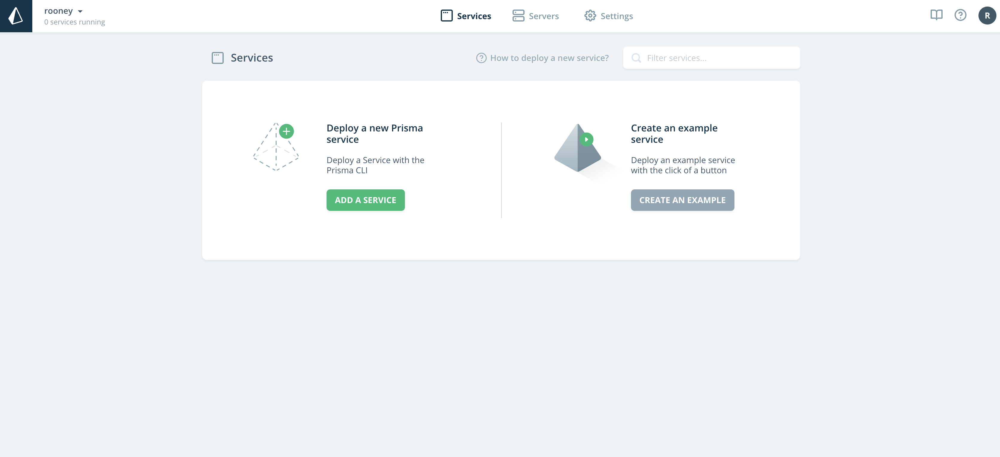
화면에 나오는대로 yarn이든 npm이든 사용하는 노드모듈을 이용하여 prisma를 전역으로 설치해 준다. 설치가 완료되면 `Log into Prisma CLI`에 있는 프리즈마 로그인 코드를 복사하여 프로젝트 콘솔에서 실행시켜주도록 한다.  
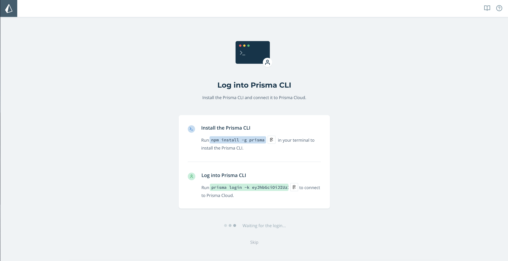
로그인에 성공했다면 아래와 같은 화면을 볼 수 있다. `CREATE NEW SERVICE`버튼을 눌러 다음 화면이로 이동하도록 한다.
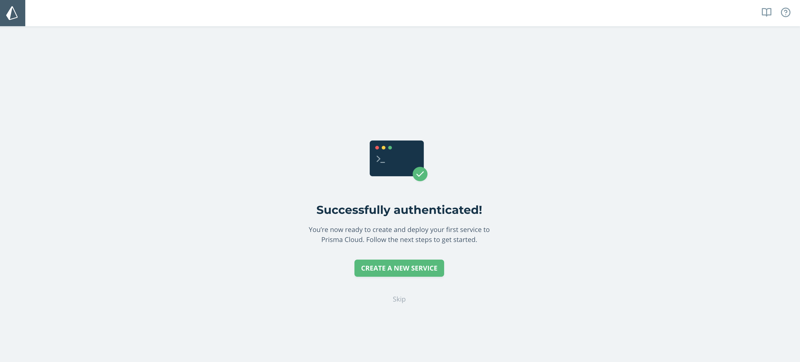  
아래 사진과 같이 프리즈마 서비스를 init 할 수 있는 코드를 볼 수 있다. 아래 코드대로 진행해도 되지만 진행하는 프로젝트의 콘솔에서 `prisma init`이라고 입력하여서 진행 할 수 있다.
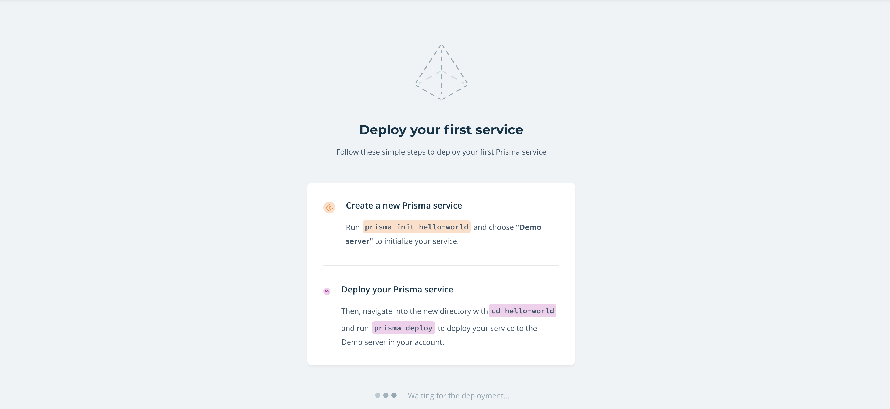  
`prisma init`이라고 입력하면 아래와 같이 개발환경을 선택 할 수 있는 옵션을 볼 수 있다. 3번째 옵션인 Demo server + MySQL database를 선택하여 실습을 진행하였다.
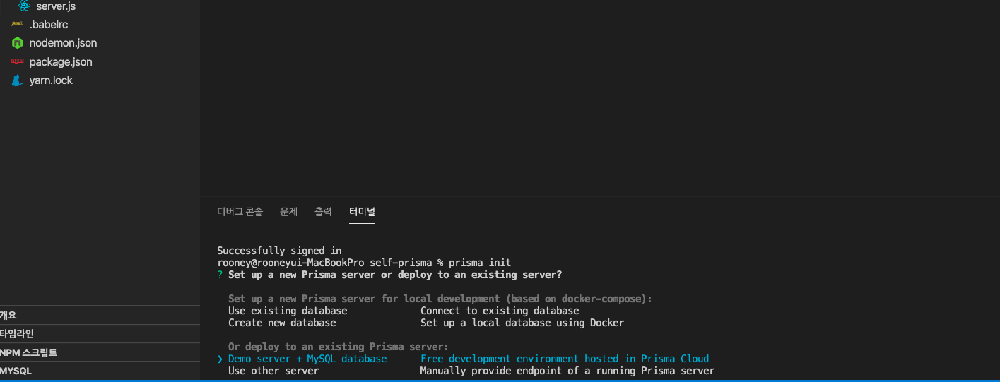

`prisma init`을 완료하면 아래 사진와 같이 폴더와 파일이 생성되는 것 을 확인 할 수 있다. 생성되는 파일과 폴더는 다음과 같다.

- generated(폴더)
- prisma.yml
- datamodel.prisma

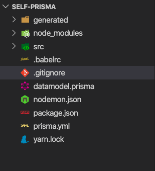  
generated(폴더)와 prisma.yml는 공개되지 않아야 할 정보들이 담겨있으므로 .gitignore을 통해 저장소에 저장되지 않도록 한다.

#### Prisma deploy

`datamodel.prisma` 파일이 바로 어플리케이션에 필요한 데이터 모델을 graphQL을 통해 생성 할 수 있도록 해주는 파일이다. 해당 파일에 graphQL을 통해 모델에 대한 코드를 작성하고 `prisma deploy` 명령어를 입력하면 모델이 생성된다.

```bash
#datamodel.prisma
type User {
  id: ID! @id
  name: String!
}
```

위와 같이 코드를 입력하고 `prisma deploy`명령어를 실행시키면 아래 사진과 같이 prisma console에 User라는 이름의 데이터 모델(query)이 생성된 것을 확인 할 수 있다.


#### DataModel with Prisma

```bash
#datamodel.prisma
type User {
  id: ID! @id
  username: String! @unique
  email: String! @unique
  firstName: String @default(value: "")
  lastName: String! @default(value: "")
  bio: String
  followers: [User!]! @relation(name: "FollowRelation")
  following: [User!]! @relation(name: "FollowRelation")
  posts: [Post!]!
  likes: [Like!]!
  comments: [Comment!]!
  rooms: [Room!]!
  loginSecret:String
}

type Post {
  id: ID! @id
  location: String
  caption: String!
  user: User!
  files: [File!]!
  likes: [Like!]!
  comments: [Comment!]!
}

type Like {
  id: ID! @id
  user: User!
  post: Post!
}

type Comment {
  id: ID! @id
  text: String!
  user: User!
  post: Post!
}

type File {
  id: ID! @id
  url: String!
  post: Post!
}

type Room {
  id: ID! @id
  participants: [User!]!
  messages: [Message!]!
}

type Message {
  id: ID! @id
  text: String!
  from: User! @relation(name: "From")
  to: User! @relation(name: "To")
  room: Room!
}
```

위 코드와 같이 graphQL과 prisma 문법을 사용하여 데이터 모델을 정의한다. 몇가지 살펴와야하는 부분이 있는데 보다 자세한 내용은 공식문서를 참조하도록 한다.  
[공식문서 바로가기](https://v1.prisma.io/docs/1.34/datamodel-and-migrations/datamodel-MYSQL-knul/#sdl-directives)

##### id: ID! @id

모든 데이더 모델에 공통적으로 들어가있는것이 있는데 바로 id이다. 경우에따라 id를 생략 할 수도 있지만 생략하게 되면 resolver를 prisma가 자동으로 생성해 주지 않는다. 프리즈마의 편한점은 resolver를 데이터 모델을 기반으로 자동으로 생성해 주는 것이다. 기존의 mongoDB나 mysql만 사용하는 경우 데이터베이스 안의 데이터를 생성하고 삭제하고 수정하는 등의 행위를 하기 위해서 별도의 코드를 작성해야했다. 그러나 prisma를 이용하면 별도의 코드 작성은 불필요하다.

##### @unique/@default/@relation

- @unique의 경우 데이터베이스안에 중복된 값으 존재할 수 없다는 의미이다. @unique 키워드를 부여한 값을 통해서 특정 데이터를 찾을 수 있다.

- @default의 경우 초기값을 지정해주는데 사용한다.

- @relation의 경우 데이터간의 양방향 관계를 설정하는데 사용한다.

##### createUser

위 코드를 delopy하고 prisma.yml 파일에 적혀있는 endpoint 주소를 브라우져에 입력하여 ployground를 실행하도록 한다. (참고로 endpoint는 타인에게 알려줘서는 안된다. 해당 ploygound에서 데이터의 변경이 가능하기 때문이다.)  
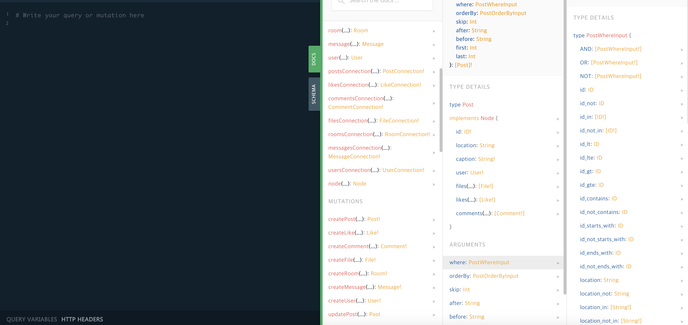

엔드포인트에 들어가게 되면 우리가 설정한 데이터를 기반으로한 query와 mutation이 자동으로 생성되있는것을 확인 할 수 있다. 이를 통해 유저를 생성할 수도 있고 유저 정보르 변경할 수도 있으며 유저를 삭제 할 수도 있다. (post, comment등 모든 데이터에 대해 가능하다.)
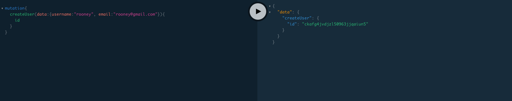
위 사진과 같이 mutation을 실행시키면 유저가 생성된것을 확인 할 수 있다. 아래 사진과 같이 prisma console에서도 확인 가능하다.(간혹 모든 입력을 정확히 했는데 에러가 발생하는 경우 크롬을 사용한다면 localStorage를 삭제한다음 로그아웃하고 다시 로그인하면 에러가 사라지는 경우가 있다. prisma console 버그인듯하다.)
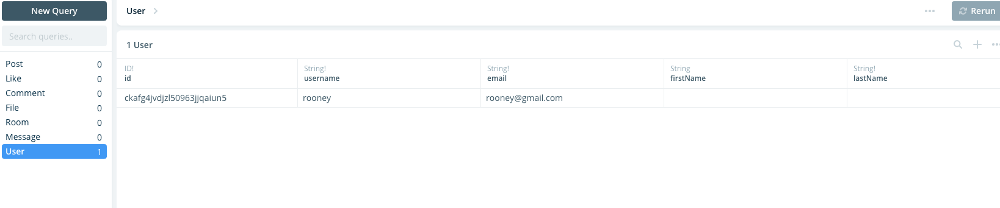

#### findUser

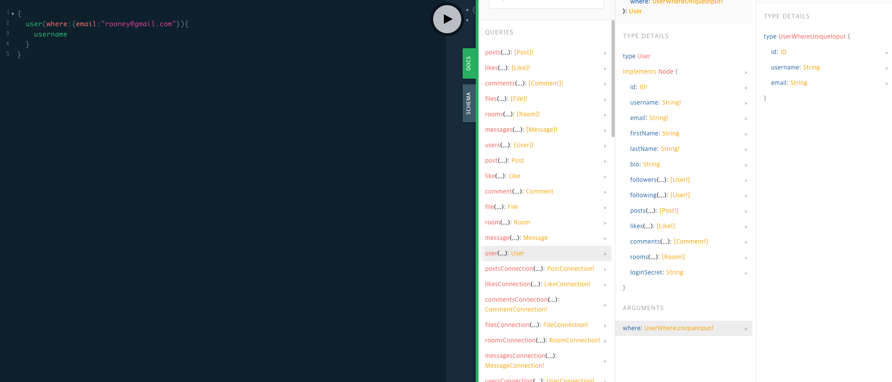
위 사진에서 보듯 우리가 데이터 모델을 설정 할 때 @unique키워드를 부여한 데이터를 가지고 특정 User를 찾을 수 있는 것을 확인 할 수 있다.

#### relation data

앞서 데이터를 정의할 때 몇몇 데이터에 @relation 키워드를 부여하였다. 그 중 followers와 following 의 양방향 관계에 대해 살펴본다.

- rooney와 hun 이라는 username을 갖는 두 사용자가 있다.
- rooney가 hun을 following 한다.
- hun의 followers에 rooney가 자동으로 추가될 것이다.

위의 시나리도대로 진행된다면 정상적으로 양방향 관계가 설정된것이다. 아래 사진 처럼 user정보를 update한다.
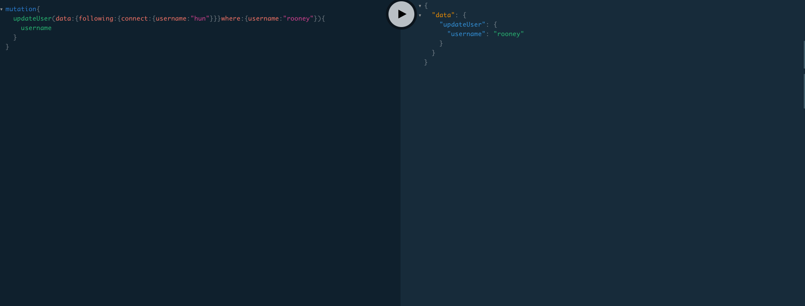
정상적으로 hun을 following 한것을 확인 할 수 있다.
이제 hun의 데이터를 살펴보도록 한다.
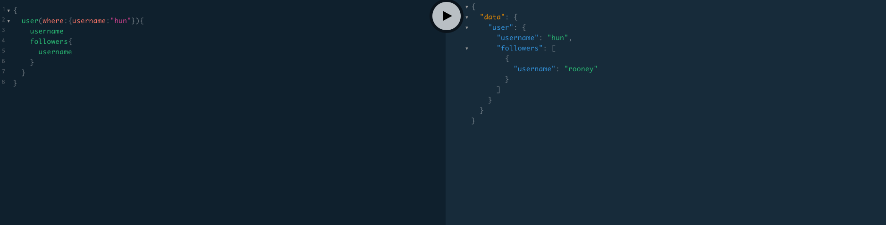
hun 데이터의 followers에 rooney가 추가 된것을 확인 할 수 있다.

#### Intergrating prisma in our server

prisma 서버와 정보를 주고 받으려면 prisma client를 다운받아야 한다. prisma client를 다운 받기 위해서는 아래와 같은 명령어를 콘솔에 입력해야 한다.

```bash
prisma generate
```

앞선 실습에서는 모두 prisma endpoint에서 직접 데이터를 생성하거나 변경하였다. 그러나 실제 어플리케이션에서는 클라이언트에서 서버로 어떤 행위(데이터의 생성, 삭제 등)에 대한 요청을 서버로 보내게 될 것이다. 그런 후 서버에서 prisma 서버로 클라이언트가 요청한 행위를 요청하게 되어 데이터의 변경이 일어나게 될 것이다.

아래와 같이 코드를 입력하고 서버를 실행시킨다.(prisma-client-lib 모듈이 없다고 에러가 뜰 수 도 있는데 yarn add prisma-client-lib로 해당 모듈을 설치해준다!)

```js
import { prisma } from "../../../generated/prisma-client";

export default {
  Query: {
    sayHello: async () => {
      console.log(await prisma.users());
      return "Hello";
    },
  },
};
```

우리가 설정해 놓은 서버 주소(localhost:4000)에 접속해어 해당 쿼리를 날려본다.
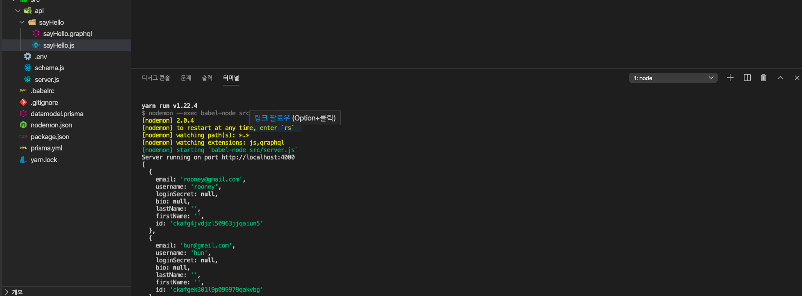
위 사진과 같이 콘솔창에 user들에 대한 정보가 찍히는 것을 확인 할 수있다. 이렇게 프리즈마 서버에 있는 데이터에 서버가 접근 할 수 있게 되는 것이다.

이제 api 폴더 안에 `models.graphql`이라는 파일을 만들고 `datamodel.prisma`에 작성한것과 똑같이 데이터 모델에 관한 정의를 해주도록 한다. 기억해야할 점은 `datamodel.prisma`에 새로운 데이터 모델을 추가했다면 `models.graphql`에도 똑같이 데이터를 추가해주어야 한다는 점이다. 그리고 `datamodel.prisma`에서 사용해주었던 @id, @unique, @default, @relation는 prisma 문법이므로 제거해주어야 한다.

```bash
# @/src/api/models.graphql
type User {
  id: ID!
  username: String!
  email: String!
  firstName: String
  lastName: String!
  bio: String
  followers: [User!]!
  following: [User!]!
  posts: [Post!]!
  likes: [Like!]!
  comments: [Comment!]!
  rooms: [Room!]!
  loginSecret: String
}

type Post {
  id: ID!
  location: String
  caption: String!
  user: User!
  files: [File!]!
  likes: [Like!]!
  comments: [Comment!]!
}

type Like {
  id: ID!
  user: User!
  post: Post!
}

type Comment {
  id: ID!
  text: String!
  user: User!
  post: Post!
}

type File {
  id: ID!
  url: String!
  post: Post!
}

type Room {
  id: ID!
  participants: [User!]!
  messages: [Message!]!
}

type Message {
  id: ID!
  text: String!
  from: User!
  to: User!
  room: Room!
}
```

src폴더 아래 User라는 폴더를 새로 만들고 `AllUser`라는 폴더를 새로 만든다. 폴더 안에 폴더 이름과 같은 graphql파일과 javascript파일을 새로 생성해준다.

```bash
# @/src/api/User/AllUser/AllUser.graghql
type Query {
  allUser: [User!]!
}
```

```js
// @/src/api/User/AllUser/AllUser.js
import { prisma } from "../../../../generated/prisma-client";

export default {
  Query: {
    allUser: () => prisma.users(),
  },
};
```

서버 주소를 통해 playground에 접속해서 `allUser` query를 날려보도록 한다.
아래 사진과 같은 결과를 얻을 수 있다.
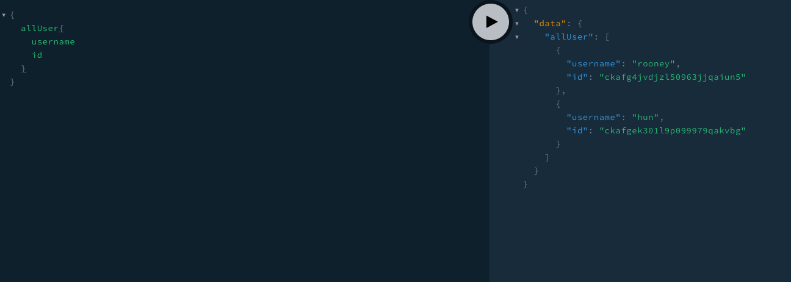

User폴더 안에 `AllUser`라는 폴더를 새로 만든다. 폴더 안에 폴더 이름과 같은 graphql파일과 javascript파일을 새로 생성해준다.

```bash
# @/src/api/User/AllUser/UserById.graghql
type Query{
  userById(id: String!): User!
}
```

```js
// @/src/api/User/AllUser/UserById.js
import { prisma } from "../../../../generated/prisma-client";

export default {
  Query: {
    userById: async (_, args) => {
      const { id } = args;
      return await prisma.user({ id });
    },
  },
};
```

userById 쿼리에 id값을 넣어 날려보면 아래와 같은 결과를 얻을 수 있다. (prisma endpoint에서는 `where`이라는 프로퍼티 안에 `id`를 넣어서 날렸는데 생략 가능한듯 하다.)
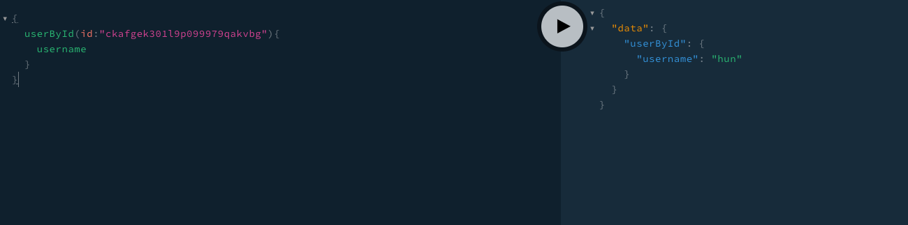

### GraphQL API

1. [Create Account](#Create-Account)
1. [Request Secret](#Request-Secret)
1. [Passport JWT](#Passport-JWT)

#### Create Account

사용자를 생성하는 GraphQL api를 작성해보도록 한다. 기존 User폴더에 있던 불필요한 폴더드를 모두 삭제한 후(기존의 것 모두) `createAccount`폴더를 새로 생성해준다. 새로 생성한 폴더 내부에 `createAccount.graphql` 파일과 `createAccount.js`파일을 생성한다.

먼저 `createAccount.graphql`파일의 코드를 작성한다. createUser resolver는 prisma가 자동으로 생성해 주었다. 어떤 parameter가 필요한지 prisma endpoint에서 확인 할 수 있다.
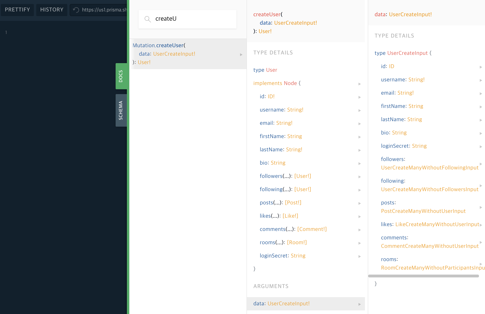
위 사진에서 보듯 username과 email은 필수적으로 넘겨주어야 하고, 그 외의 값들은 선택적으로 넘겨줄 수 있다. 따라서 아래와 같이 코드를 작성하였다. Query 없이 Mutation만 작성하면 에러가 발생하므로 아무런 의미 없는 Query도 작성하였다.

```bash
# @/src/api/User/createAccount/createAccount.graphql
type Mutation {
  createAccount(
    username: String!
    email: String!
    firstName: String
    lastName: String
    bio: String
  ): User!
}

type Query {
  something: String!
}
```

```js
// @/src/api/User/createAccount/createAccount.js
import { prisma } from "../../../../generated/prisma-client";
export default {
  Mutation: {
    createAccount: async (_, args) => {
      const { username, email, firstName = "", lastName = "", bio = "" } = args;
      const user = await prisma.createUser({
        username,
        email,
        firstName,
        lastName,
        bio,
      });
      return user;
    },
  },
};
```

아래 사진 처럼 localhost:4000에 접속하여서 새로 생성한 `createAccount` mutation을 날려 본다.
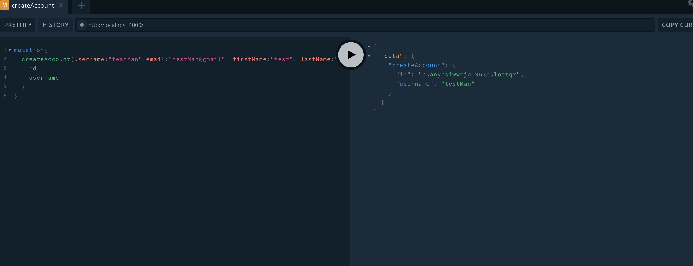

아래 사진과 같이 prisma console에 방금 생성한 유저가 추가 된것을 확인 할 수 있다.
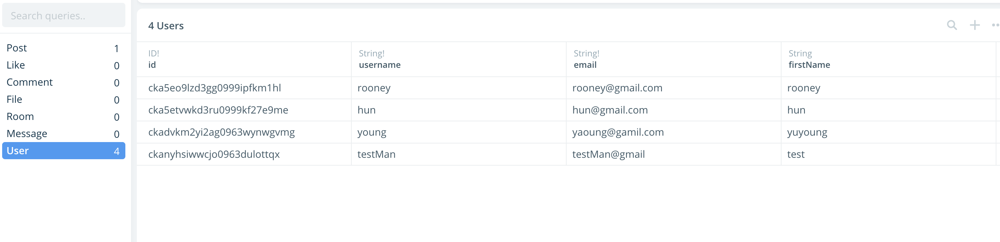

#### Request Secret

통상적으로 로그인하는 방식인 아이디와 비밀번호를 입력하는 방식 대신 유저의 이메일로 임의의 문자를 보내주고 유저가 어플리케이션의 로그인창에 해당 문자를 입력하면 로그인되는 방식을 구현하려고 한다. api 폴내 외부에(중요!) `utils.js`파일과 `words.js` 파일을 생성한다. `words.js` 파일에는 임의의 형용사 500개와 임의의 명사 500개를 배열로 저장하도록 한다. 구글에 `words generator`라고 검색하면 임의의 문자를 생성해주는 사이트들이 나오는데 편한 사이트를 이용하면된다.

```js
//@/src/words.js
export const adjectives =[
  "moaning",
  "gruesome",
  "industrious",
  "petite",
  "even",
  ...
]
export const nouns = [
  "board",
  "yoke",
  "work",
  "drain",
  "competition",
  "downtown",
  ...
]
```

utils.js에서는 앞서 저장한 형용사 배열과 명사 배열에서 무작위로 임의의 문자를 뽑는 코드를 작성한다.

```js
//@/src/utils.js
import { adjectives, nouns } from "./words";

export const generateSecret = () => {
  const randomNumber = Math.floor(Math.random() * adjectives.length);
  return `${adjectives[randomNumber]} ${nouns[randomNumber]}`;
};
```

이제 이 임의의 문자열을 user정보에 저장하는 api를 작성하도록 한다. User 폴더에 `requestSecret`라는 폴더를 만들고 동일한 이름의 graphql파일과 js파일을 생성하고 아래와 같이 코드를 입력한다.

```bash
#  @/src/api/User/createAccount/requestSecret.graphql
type Mutation {
  requestSecret(email: String!): Boolean!
}
```

```js
// @/src/api/User/createAccount/requestSecret.js
import { generateSecret } from "../../../utils";
import { prisma } from "../../../../generated/prisma-client";

export default {
  Mutation: {
    requestSecret: async (_, args) => {
      const { email } = args;
      const loginSecret = generateSecret();
      try {
        await prisma.updateUser({ data: { loginSecret }, where: { email } });
        return true;
      } catch {
        return false;
      }
    },
  },
};
```

아래 사진과 같이 서버에서 요청을 보내면 true 값이 반환되는 것을 확인 할 수 있다.
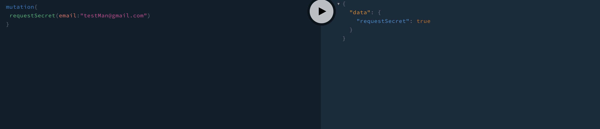
prisma console에서 확인해보면 임의의 문자가 데이터에 저장된 것을 확인 할 수 있다.
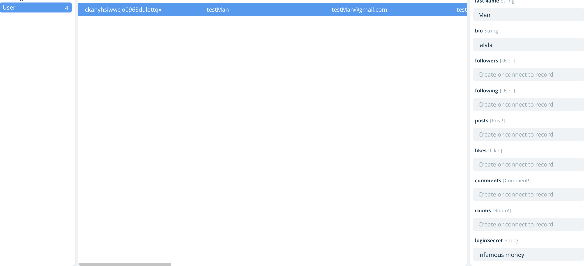

이제 이 임의의 문자를 유저의 이메일로 전송해 주어야 하는데, 서버에서 유저의 이메일로 메일을 발송하기 위해서 `nodemailer`라는 모듈을 사용한다.

```bash
yarn add nodemailer
```

또 send grid라는 외부메일 서비스를 이용할 것인데 이를 위해서는 모듈을 설치해주어야하고 send grid 회원가입을 진행해야한다.

```bash
yarn add nodemailer-sendgrid-transport
```

[send grid 사이트 바로가기]("https://sendgrid.com/")

회원가입을 진행 한 후 `utils.js`파일에 아래와 같은 코드를 추가로 작성한다.

```js
// @/src/utils.js
import dotenv from "dotenv";
import path from "path";
dotenv.config({ path: path.resolve(__dirname, ".env") });

import { adjectives, nouns } from "./words";
import nodemailer from "nodemailer";
import sgTransport from "nodemailer-sendgrid-transport";

export const generateSecret = () => {
  const randomNumber = Math.floor(Math.random() * adjectives.length);
  return `${adjectives[randomNumber]} ${nouns[randomNumber]}`;
};

const sendMail = (email) => {
  const options = {
    auth: {
      api_user: process.env.SENDGRID_USERNAME,
      api_key: process.env.SENDGRID_PASSWORD,
    },
  };
  const client = nodemailer.createTransport(sgTransport(options));
  return client.sendMail(email);
};

export const sendSecretMail = (address, secret) => {
  const email = {
    from: "bch3454@gmail.com",
    to: address,
    subject: "🔒Login Secret for Prismagram🔒",
    html: `Hello! Your login secret it ${secret}.<br/>Copy paste on the app/website to log in`,
  };
  return sendMail(email);
};
```

회원가입한 아이디와 비밀번호를 `.env`파일에 저장한 후에 불러와서 사용하도록 한다. 여기서 `sendSecretMail`에서 `from` 프로퍼티의 값으로 이메일을 입력하게 되는데 아래와 같은 에러가 보일 수 도 있다.(에러가 발생하지 않는 다면 패스!)

```bash
The from address does not match a verified Sender Identity. Mail cannot be sent until this error is resolved. Visit https://sendgrid.com/docs/for-developers/sending-email/sender-identity/ to see the Sender Identity requirements
```

https://app.sendgrid.com/settings/sender_auth 위 경로에서 `Single Sender Verification` 인증을 하면 정상적으로 작동 할 것이다.

테스트를 하기 위해 `server.js`파일에 아래와 같은 코드를 추가한다.

```js
// @/src/server.js
import dotenv from "dotenv";
import path from "path";

dotenv.config({ path: path.resolve(__dirname, ".env") });

import { GraphQLServer } from "graphql-yoga";
import logger from "morgan";
import schema from "./schema";
import { sendSecretMail } from "./utils";

sendSecretMail("nevertheless0402@gmail.com", "!23");

const PORT = process.env.PORT || 4000;

const server = new GraphQLServer({ schema });

server.express.use(logger("dev"));

server.start({ port: PORT }, () =>
  console.log(`Server running on port http://localhost:${PORT}`)
);
```

실제 본인이 사용하는 이메일을 입력하고, 임의의 문자열을 아무렇게나 입력하게 되면 아래 사진과 같이 메일이 발송된것을 확인 할 수 있다.
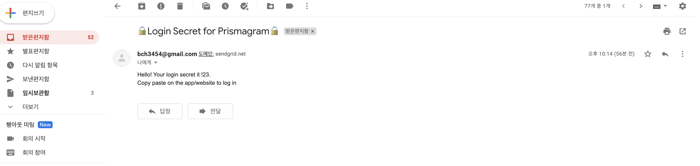

#### Passport JWT

##### JSON Web Tokens

JSON Web Tokens 이란 로그인한 사용자의 정보를 서버의 세션에 저장하고 사용자를 식별하는 인증 표준입니다. 작동 로직은 아래와 같습니다.

1. 사용자의 이메일로 secret key를 전송합니다.
1. 사용자는 로그인을 하기 위해서 email과 secret key를 입력해야 합니다.
1. 사용자가 입력한 email을 이용하여 DB에서 해당 email을 갖는 사용자를 검색합니다. 해당 사용자의 secret key와 입력한 secret key가 동일한 경우 jsonwebtoken을 이용하여 토큰을 생성합니다. 생성된 토큰은 브라우져의 localstorage 또는 쿠키에 저장됩니다.
1. 서버에 JSON Web Tokens을 검증하는 미들웨어를 구축합니다.
1. 사용자가 서버에 요청을 보내는 경우 언제나 미들웨어를 통과해야 정상적인 통신이 이루어지게 됩니다.
1. 따라서 로그인된 사용하는 http Header에 발급받은 토큰을 실어서 요청을 보내야 합니다.

차례대로 구성해보도록 하겠습니다. 먼저 `jsonwebtoken'을 설치해주도록 합니다.

```bash
yarn add jsonwebtoken
```

1 ~ 3에 해당하는 코드는 아래와 같습니다.
```js
//utils.js
import { adjectives, nouns } from "./words";
import nodemailer from "nodemailer";
import sgTransport from "nodemailer-sendgrid-transport";
import jwt from "jsonwebtoken";
.
.
.
export const generateToken = (id) => jwt.sign({ id }, process.env.JWT_SECRET);
```
`sign()`메서드는 기본 값으로 HMAC SHA256알고리즘을 사용합니다. 첫 번째 인자로는 payload, 즉 내용을 작성합니다. payload부분은 따로 암호화가 진행되지 않으므로 중요한 정보는 포함시키지 않는것이 좋습니다. 두 번째 인자로는 비밀키를 전달합니다. 해당 비밀키를 통해 암호화를 진행하므로 비밀키가 노출되지 않는다면 데이터의 무결성을 보장 할 수 있습니다. 

```js
import { prisma } from "../../../../generated/prisma-client";
import { generateToken } from "../../../utils";

export default {
  Mutation: {
    confirmSecret: async (_, args) => {
      const { email, secret } = args;
      const user = await prisma.user({ email });
      if (user.loginSecret === secret) {
        return generateToken(user.id);
      } else {
        throw Error("Wrong email/secret combination");
      }
    },
  },
};
```
사용자가 입력한 이메을을 통해서 prisma console에 해당 email을 갖는 유저가 있는지 찾습니다. 찾은 유저의 loginSecret 값과 입력한 loginSecret 값이 동일한 경우 토큰을 생성하여 반환하도록 합니다. 

미들웨어를 구축하기 위하여 아래 모듈을 설치하도록 합니다. 
```bash
yarn add passport passport-jwt
```
4 ~ 6 번에 해당하는 코드는 아래와 같습니다. 
```js
// @/src/passport.js
import passport from "passport";
import { Strategy, ExtractJwt } from "passport-jwt";
import { prisma } from "../generated/prisma-client";

const jwtOptions = {
  // header에 bearer스키마에 담겨온 토큰 해석할 것
  jwtFromRequest: ExtractJwt.fromAuthHeaderAsBearerToken(),
  // 해당 비밀키로 복호화
  secretOrKey: process.env.JWT_SECRET,
};

const verifyUser = async (payload, done) => {
  try {
    const user = await prisma.user({ id: payload.id });
    if (user !== null) {
      return done(null, user);
    } else {
      return done(null, false);
    }
  } catch (error) {
    return done(error, false);
  }
};

export const authenticateJwt = (req, res, next) =>
  passport.authenticate("jwt", { sessions: false }, (error, user) => {
    if (user) {
      req.user = user;
    }
    next();
  })(req, res, next);

passport.use(new Strategy(jwtOptions, verifyUser));
passport.initialize()
```