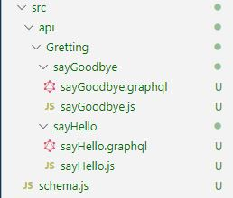

# prismagram_react-graphql

Instragram clone with Express Prisma React and React Native

## Backend

1. [Setting](#Setting)
1. [Create Server](#Create-Server)

### Setting

```bash
# Backend Sever
yarn add graphql-yoga

# devDependency for ES6
yarn add @babel/node @babel/preset-env @babel/core

#devDependency that do not requrie server restart when you modity your code
yarn add nodemon -D

#Dependency that protect your secret info
yarn add dotenv

# middleware for logging
yarn add morgan
```

```bash
#.babelrc in root
{
    "presets": ["@babel/preset-env"]
}
```

```bash
#Create script code in package.json in root
 "script": {
      "dev": "nodemon --exec babel-node src/server.js"
  }
```

```bash
# nodemon.json in root (nodemon이 감시해야 할 파일의 확장자를 지정 할 수 있음)
{
    "ext": "js qraphql"
}
```

```bash
# .env in root
PORT = 4000
```

### Create Server

GraphQL 서버를 구성 할 때 `schema`와 `resolver`를 구성하고 이를 서버 생성자 함수의 인자로 추가해 주어야한다. 기본적인 GraphQL 서버 구성 코드는 아래와 같다. 아래와 같이 서버를 구성하는 경우 `schema`파일에 서버에서 사용 할 모든 `schema`를 작성하게되고, `resolver`도 마찬가지로 모든 `resolver`를 하나의 파일에 작성해야 한다. 이는 코드의 가독성을 떨어트리고 유지보수의 어려움을 야기시키므로 필요한 데이터에 따라 `schema`와 `resolver`를 구성하는 방법에 대해 알아본다. [GraphQL의 기본적인 사용방법][1]에대해 잘 모른다면 정리한 README가 있으니 참고하도록 한다.

[1]: https://github.com/CHEOLHUN/basic-theory-graphql_graphql

```javascript
//기본적인 GraphQL 서버 구성 코드
import { GraphQLServer } from "graphql-yoga";
import resolvers from "./graphql/resolvers";

require("dotenv").config();
const PORT = process.env.PORT || 4000;

const server = new GraphQLServer({
    typeDefs: "src/graphql/schema.graphql",
    resolvers
});

server.start({ port: PORT }, () =>
    console.log(`Server running on port http://localhost:${PORT}`)
);
```

`graphql-tools`과 `merge-graphql-schemas`를 사용하는 경우 여러개의 `schema`와 `resolver`를 하나의 파일로 합쳐서 관리 할 수 있다.

```bash
#install modules
yarn add graphql-tools
yarn add merge-graphql-schemas
```

디렉토리의 구성은 아래와 같이 구성하면 된다.


`api`디렉토리안에 모든 `schema`와 `resolver`에 대한 파일을 넣게되면 root 디렉토리에 있는 `schema.js`파일에서 이 모든 파일을 합쳐서 하나의 `scheme`와 `resolver`로 만들어 준다. `schema.js` 코드는 아래와 같다.

```javascript
//schma.js
import { makeExecutableSchema } from "graphql-tools";
import { fileLoader, mergeResolvers, mergeTypes } from "merge-graphql-schemas";
import path from "path";

const allTypes = fileLoader(path.join(__dirname, "/api/**/*.graphql"));
const allResolvers = fileLoader(path.join(__dirname, "/api/**/*.js"));

const schema = makeExecutableSchema({
    typeDefs: mergeTypes(allTypes),
    resolvers: mergeResolvers(allResolvers)
});

export default schema;
```

`fileLoader`가 api 디렉토리 안의 모든 파일을 가져오는 역할을 담당한다. `**`은 api디렉토리안의 `모든 디렉토리`를 의미하며, `*.graphql`은 `.graphql`확장자를 갖는 모든 파일을 의미한다. 즉 api 디렉토리 안의 `.graphql`확장자를 갖는 모든 파일을 가져와 `allTypes` 변수에 저장하는 것이다. `resolver`도 이와 같은 원리로 `allResolvers` 변수에 저장한다. 그 후 `mergeTypes`에 의해서 가져온 모든 `.graphql`파일을 하나의 타입으로 만들고, `mergeResolvers`에 의해서 모든 `resolver`파일을 하나의 resolver로 만든다 마지막으로 `makeExecutableSchema`로 `schema`와 `resolver`를 하나로 합쳐 주게된다.

```javascript
//server.js
require("dotenv").config();
import { GraphQLServer } from "graphql-yoga";
import logger from "morgan";
import schema from "./schema";

const PORT = process.env.PORT || 4000;

const server = new GraphQLServer({ schema });

server.express.use(logger("dev"));

server.start({ port: PORT }, () =>
    console.log(`Server running on port http://localhost:${PORT}`)
);
```

`server.js`에서 `schema.js`에서 만든 `schema`를 import 한 후 서버 생성자 함수의 인자로 넣어주면 각자 만든 Query를 사용 할 수 있게 된다. 앞으로 추가하게될 모든 Query나 Mutation등에 대해서도 별도의 설정없이 `api` 디렉토리안에 데이터별로 디렉토리를 생성하여 만들어주기만 하면 사용할 수 있다. `api`디렉토리에는 `schema`와 `resolver`에 관련된 파일 외의 다른 파일을 생성하면 에러가 발생하므로 주의하도록 한다.
